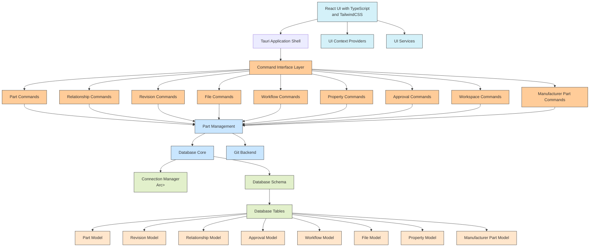
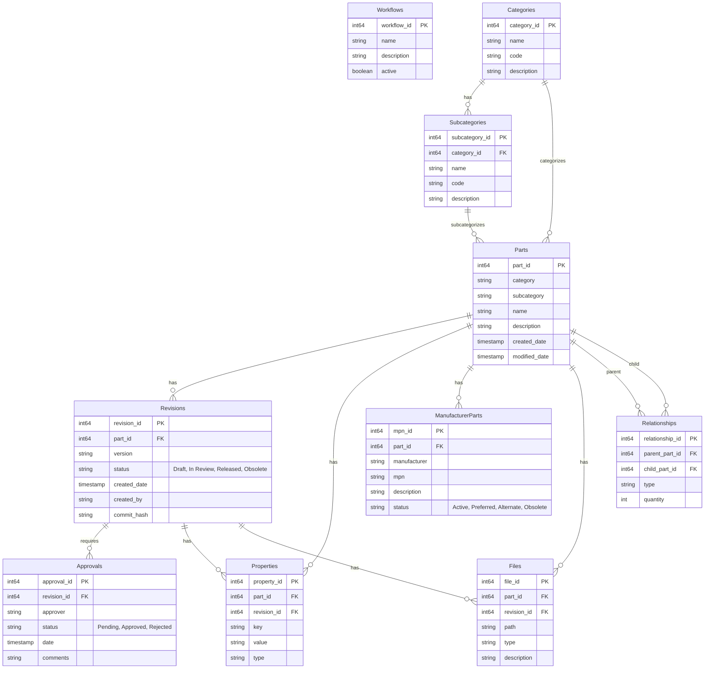
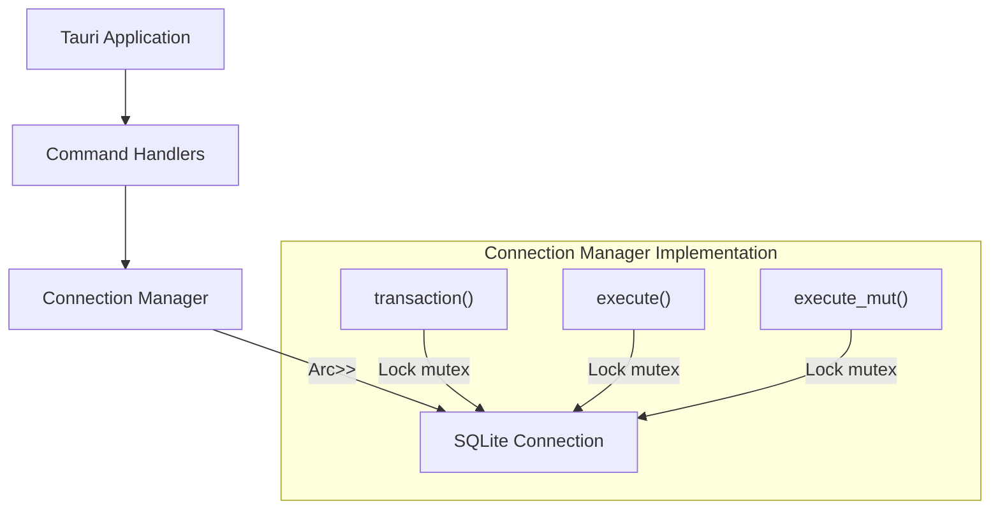
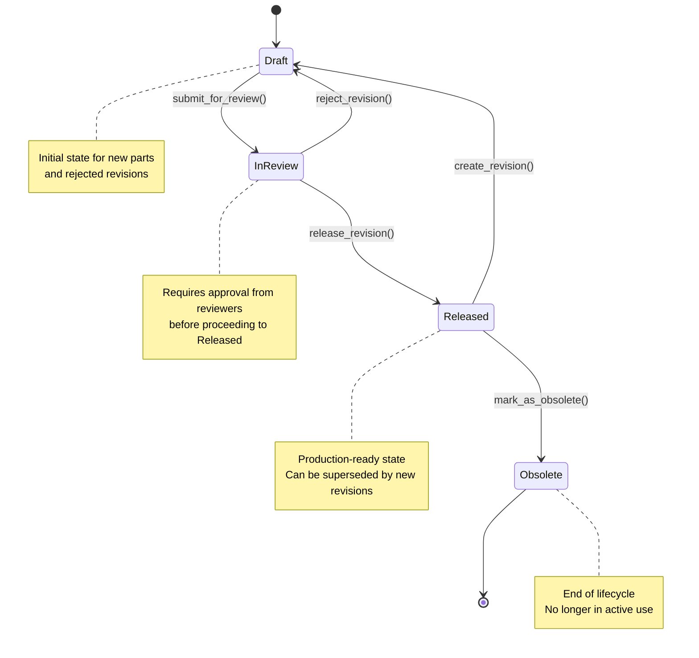

# Implexa Architecture Diagram

**Navigation:** [productContext](./productContext.md) | [activeContext](./activeContext.md) | [progress](./progress.md) | [decisionLog](./decisionLog.md) | [Memory Bank Index](./memory-bank-index.md)

## Overview

This document provides a visual representation of the Implexa PLM system architecture, showing the relationships between major components and the data flow within the application.

## Component Architecture

The Implexa architecture follows a dual-crate structure with clear separation between the library functionality and the binary application layer. The diagram below illustrates the current and proposed architecture for better code organization.



## Crate Structure - Current vs Proposed

The diagram below shows the current crate structure with command duplication issues and the proposed refactored structure:

```mermaid
graph TD
    %% Current Structure
    subgraph "Current Structure"
        MAIN_CRATE[main.rs\nBinary Crate]
        LIB_CRATE[lib.rs\nLibrary Crate]
        
        MAIN_COMMANDS[Command Files\ncommands.rs\npart_commands.rs\nrevision_commands.rs\netc.]
        
        LIB_MODULES[Core Functionality\ngit_backend/\ndatabase/\netc.]
        
        MAIN_CRATE --- MAIN_COMMANDS
        MAIN_CRATE --- LIB_CRATE
        LIB_CRATE --- LIB_MODULES
        
        %% Issue: Circular Dependencies
        MAIN_COMMANDS -.-> LIB_MODULES
        LIB_MODULES -.-> MAIN_COMMANDS
    end
    
    %% Proposed Structure
    subgraph "Proposed Structure"
        MAIN_CRATE2[main.rs\nBinary Crate\n(Command Registration Only)]
        LIB_CRATE2[lib.rs\nLibrary Crate]
        
        LIB_MODULES2[Core Functionality\ngit_backend/\ndatabase/\netc.]
        
        COMMAND_MODULES[Command Modules\ncommands/mod.rs\ncommands/parts.rs\ncommands/workflow.rs\netc.]
        
        MAIN_CRATE2 --> LIB_CRATE2
        LIB_CRATE2 --> LIB_MODULES2
        LIB_CRATE2 --> COMMAND_MODULES
        COMMAND_MODULES --> LIB_MODULES2
    end
```

## Database Structure

The database schema includes the following key tables:



## Thread Safety Implementation

The connection manager uses a thread-safe pattern with mutex protection:



## Part Management Workflow

The part lifecycle is managed through state transitions:



## Code Structure

Based on the project review, here is the high-level source code structure:

- **src/**
  - **lib.rs** - Library crate entry point
    - **database/** - Database functionality
      - **connection_manager.rs** - SQLite connection management
      - **schema.rs** - Database schema definition
      - **part.rs** - Part model and operations
      - **part_management.rs** - Part lifecycle management
      - **revision.rs** - Revision model and operations
      - **approval.rs** - Approval model and operations 
      - **relationship.rs** - Relationship model and operations
      - **property.rs** - Property model and operations
      - **manufacturer_part.rs** - Manufacturer part model and operations
      - **file.rs** - File tracking model and operations
      - **workflow.rs** - Workflow model and operations
    - **git_backend/** - Git integration functionality
      - **repository.rs** - Git repository operations
      - **operation.rs** - Git operation handling
      - **auth.rs** - Authentication handling
      - **conflict.rs** - Conflict resolution
      - **directory.rs** - Directory management
      - **hook.rs** - Git hook management
      - **lfs.rs** - Git LFS support
  - **main.rs** - Binary crate entry point
    - **commands.rs** - Command registration
    - Various command handlers:
      - **part_commands.rs**
      - **relationship_commands.rs**
      - **revision_commands.rs**
      - **file_commands.rs** 
      - **approval_commands.rs**
      - **manufacturer_part_commands.rs**
      - **property_commands.rs**
      - **workflow_commands.rs**
      - **workspace_commands.rs**
  - **ui/** - Frontend code
    - **App.tsx** - Main application component
    - **components/** - UI components
    - **context/** - React context providers
    - **hooks/** - Custom React hooks
    - **layouts/** - Page layouts
    - **pages/** - Application pages
    - **services/** - Service layer for API calls

## Conclusion

This architecture diagram illustrates the current and planned structure of the Implexa PLM system. The application uses a dual-crate structure where the library crate provides core functionality and the binary crate focuses on exposing that functionality through Tauri commands.

The proposed refactoring will improve code organization by moving all command implementations into the library crate, eliminating circular dependencies, and providing a cleaner separation of concerns.

## Related Files
- [Crate Structure Architecture](./crate-structure-architecture.md) - Details on the crate structure
- [SQLite Thread Safety Implementation](./sqlite-thread-safety-implementation.md) - Details on database connection management
- [Database Schema Design](./database-schema-design.md) - Details on the database schema
- [Part Management Workflow](./part-management-workflow.md) - Details on part lifecycle